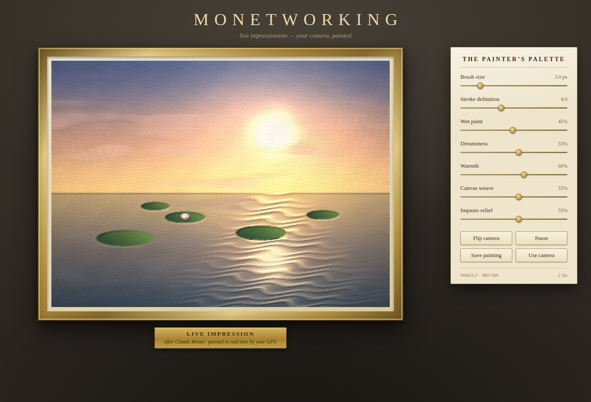
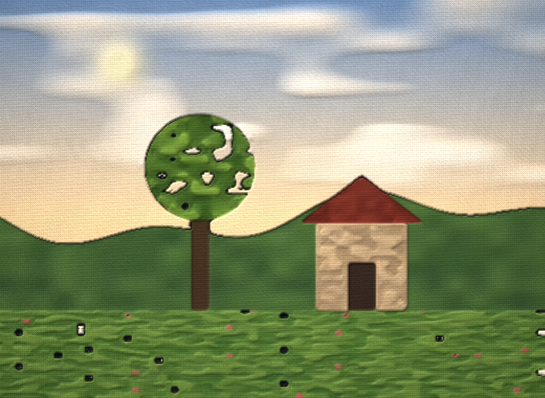
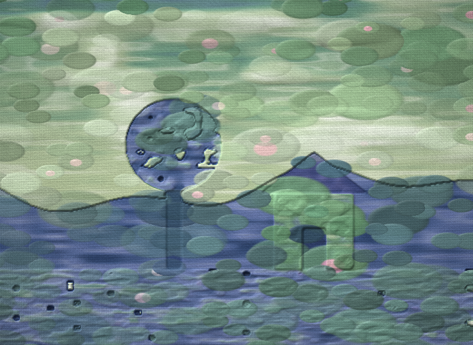
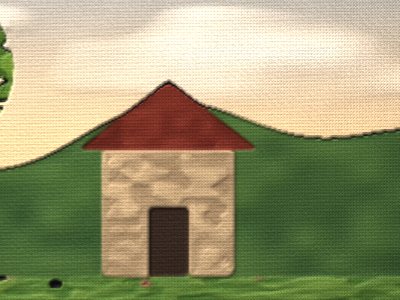

# Monetworking

Your camera, painted live as a Monet-esque impressionist canvas — entirely in the
browser, on the GPU, in real time.



## Run it

Camera access needs a secure context, so serve the folder and open it on
`localhost` (or any https host):

```sh
python3 -m http.server 8000     # or: npm start
# then open http://localhost:8000
```

Grant camera permission and you're painting. No build step, no dependencies —
it's a static page (`index.html`, `app.js`, `shaders.js`, `style.css`).

If there's no camera (or you decline), it paints a built-in animated
water-lily garden instead; the **Demo scene** button switches between the two.

## The painter's palette

| Slider | What it does |
| --- | --- |
| **Lily-pond camouflage** | Semantic camouflage: dissolves the scene into Monet's pond — shadows become deep water, midtones become lily-pad clusters, highlights become sky reflections and blossoms. Your silhouette stays hidden in the tonal masses, like a car disguised as a forest. 0 = plain plein-air painting. |
| **Brush size** | Radius of the elliptical stroke kernel |
| **Stroke definition** | How crisply strokes separate from their neighbours |
| **Wet paint** | Blends each frame into the last — calms flicker, adds motion smear |
| **Dreaminess** | Pastel grade: cool lifted shadows, creamy highlights |
| **Warmth** | Cool morning light ↔ warm sunset light |
| **Canvas weave** | How much the linen texture shows through |
| **Impasto relief** | Thick-paint lighting on stroke edges |

Buttons: **Flip camera** (front/rear), **Pause** (freezes the painting; grade
sliders stay live), **Save painting** (downloads a PNG), **Demo scene**.

URL flags: `?demo=1` skips the camera, `?low=1` halves the working resolution
for weak GPUs.





## How it works

Five WebGL2 passes per frame:

1. **Source** — the camera frame (mirrored for selfie view) or the procedural
   garden is drawn into a working buffer (≤ 960 px wide).
2. **Structure tensor** — Sobel gradients give the local image geometry.
3. **Gaussian blur** ×2 (separable) — smooths the tensor into a stable flow
   field; its eigenvectors are the stroke directions.
4. **Anisotropic Kuwahara filter** — the painterly core, after Kyprianidis,
   Kang & Döllner. Around every pixel, an ellipse stretched along the local
   flow is split into 8 overlapping sectors with polynomial weights; each
   sector's mean color is blended by how *homogeneous* it is. Low-variance
   sectors win, so colors pool into flat, directional dabs with crisp
   boundaries — brush strokes that follow the contours of what they paint.
   A temporal blend ("wet paint") settles the strokes between frames.
5. **Composite** — Monet grade (cool violet shadows, warm creamy lights,
   gentle pastel), impasto lighting from the paint's luminance gradients, a
   procedural plain-weave linen with its own normal map, specular sheen, and
   a soft vignette — drawn at display resolution inside a gilded CSS frame.

The **lily-pond camouflage** stage sits between the grade and the lighting.
It is a structure-preserving material swap: a monotonic luminance → pond
palette keeps the image's tonal ordering, while two jittered grid layers of
elliptical lily pads inherit the painting's luminance at each pad's centre —
so the *pad field itself* forms the hidden picture, the way canopy masses
form the car in classic camouflage illusions. Deep shadows stay open water,
ripple dabs cross the lights, and bright pads occasionally carry a blossom.

Float render targets are used for the tensor when `EXT_color_buffer_float`
is available, with an 8-bit packed fallback otherwise.

## The AI atelier — generative semantic camouflage

The shader pipeline *repaints*; the atelier *re-imagines*. A local diffusion
server receives each camera frame and regenerates it from noise under a
prompt, so objects are genuinely reinterpreted — a wheel can become a bush.
This is the real "car hidden as a forest" mechanism:

```
browser (this app)                         server/monet_server.py
┌────────────────────────┐                ┌──────────────────────────────┐
│ camera → source buffer │ ─ JPEG/WS ───▶ │ depth estimate (Depth-Anything)│
│                        │                │   └▶ ControlNet locks structure│
│ temporal blend ◀───────│ ◀─ JPEG/WS ──  │ img2img diffusion (SD-Turbo /  │
│   └▶ weave + impasto   │                │   SD1.5+LCM) replaces materials│
│       composite        │                └──────────────────────────────┘
└────────────────────────┘
```

The two knobs map directly onto the camouflage idea:

- **Dream strength** — img2img denoising strength: how far the model may
  drift from your frame. High = materials fully dissolve into the prompt.
- **Structure lock** — ControlNet-depth weight: how firmly your silhouette
  is pinned while everything else dissolves. High lock + high strength is
  the hidden-object sweet spot.

Run it (Python 3.10+; an NVIDIA GPU makes it real-time):

```sh
pip install websockets pillow                  # always
pip install torch diffusers transformers accelerate   # for real diffusion

python server/monet_server.py --mock           # plumbing test, no ML
python server/monet_server.py                  # SD-Turbo img2img (fast)
python server/monet_server.py --controlnet     # depth-locked camouflage (best)
```

Then click **Connect AI** in the app and type any disguise into the prompt
box. Models download from Hugging Face on first run. Rough expectations:
SD-Turbo ≈ 15–25 fps and ControlNet+LCM ≈ 5–10 fps on a mid-range NVIDIA
card; Apple Silicon a few fps; CPU is seconds-per-frame (use `--mock` to
test the loop). Generated frames are temporally blended on the GPU (the
**Wet paint** slider controls it) and still pass through the linen weave
and impasto composite, so the result stays a painting on canvas.

## Testing

```sh
npm test     # needs playwright + chromium (npx playwright install chromium)
```

Serves the app, opens headless Chromium with a **fake camera device**, waits
for the pipeline to produce frames in both camera and demo modes, fails on any
shader/console error or a blank canvas, and drops screenshots in `test/out/`.

```sh
node test/ai-mock.cjs
```

End-to-end test of the atelier loop: starts `monet_server.py --mock`, connects
the app to it, and verifies frames make the full round trip onto the canvas.
